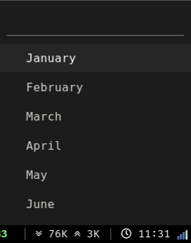

# rofi-calendar

This is the modified version of [rofi-calendar](https://github.com/vivien/i3blocks-contrib/tree/master/rofi-calendar) by [vivien](https://github.com/vivien). 
It will display a nice looking minimal calendar pop-up in rofi when clicking the date blocklet. Right clicking will show the next month and middle click will show list of months which can be selected by clicking to display calendar of that month. In the blocklet it will display the current time in HH:MM format.


* Fig 1: Rofi Calendar This Month


* Fig 1: Rofi Calendar Next Month


* Fig 1: Rofi Calendar Month Selection

	
# Dependencies

- rofi 
- cal from util-linux package, supporting --color=always

# Installation

- Copy the script into your directory of choice, e.g. ~/.i3blocks/scripts/
- Give it execution permission (`chmod +x rofi-calendar`)
- Edit rofi launch options in the script to fit your needs
- Add the following blocklet to your i3blocks.conf:

```ini
[rofi-calendar]
command=$SCRIPT_DIR/rofi-calendar
interval=30
LABEL=
#DATEFTM=+%a. %d. %b. %Y
#SHORTFTM=+%d.%m.%Y
```

# Author(s)
- [Avasz](https://github.com/avasz)

# Acknowledgements
- [vivien](https://github.com/vivien) for [i3blocks](https://github.com/vivien/i3blocks) & (i3blocks-contrib)[https://github.com/vivien/i3blocks-contrib].
- [Dave Davenport](https://github.com/davedavenport) for rofi.
