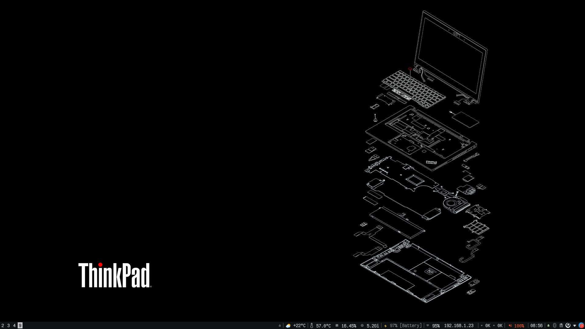
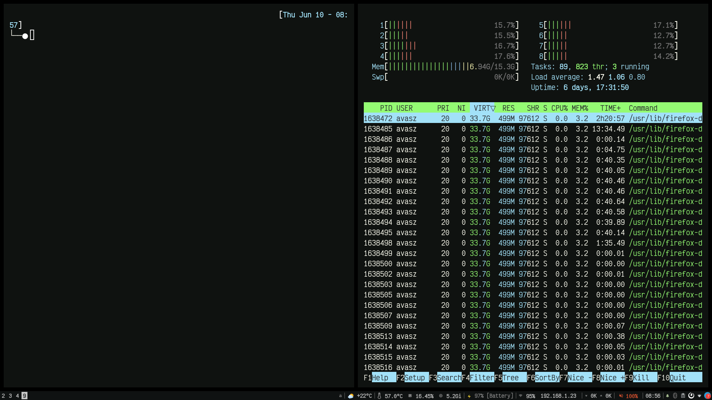
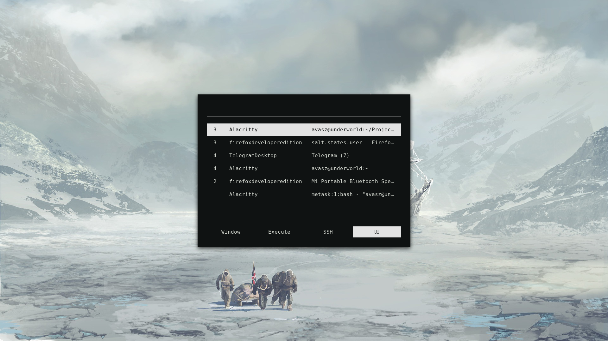
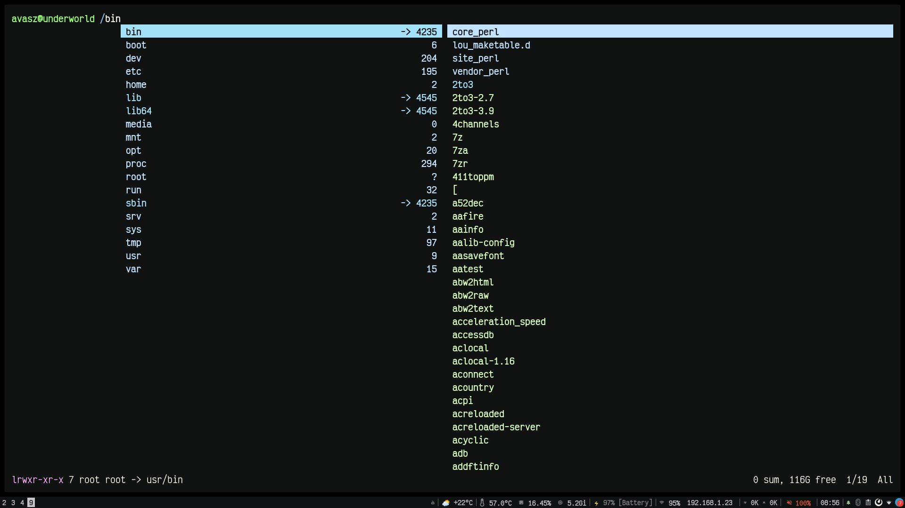
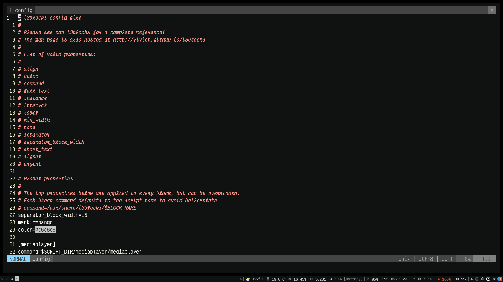

# Dotfiles - Avasz

To Backup:
```
./dotfiles backup
```

To Restore:
```
./dotfiles restore
```
The following are backed-up:
- .Xresources
- .vimrc
- .tmux.conf
- .bashrc
- .config/
	- i3/
	- i3blocks/
	- rofi/
	- picom
	- ranger/
	- alacritty/
- List of installed packages via `pacman -Qe`

# Screenshots




  


  


# Disclaimer

I have tried to generalize all the configurations but still I can not take any responsibilities if you desktop becomes unusable after using the dotfiles.

# Author(s)
- [Avasz](https://github.com/avasz)

# Acknowledgements
- Hats off to everyone whose apps and tools and configs I have used!! :)
